# Module-11-Challenge-Forecasting-Net-Prophet

## Findings
- I used the `.groupby` and `.sum()` functions to calculate the traffic in May and the median monthly traffic. After comparing them, I found that the Google search traffic increased during the month that MercadoLibre released its financial results.
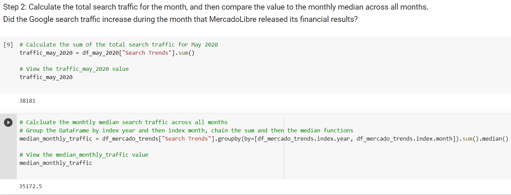

- After using hvPlot to visualize the hour of the day and day of week search traffic as a heatmap, we can see that the traffic mostly concentrate in the period of 10 pm to 2 am the next day.
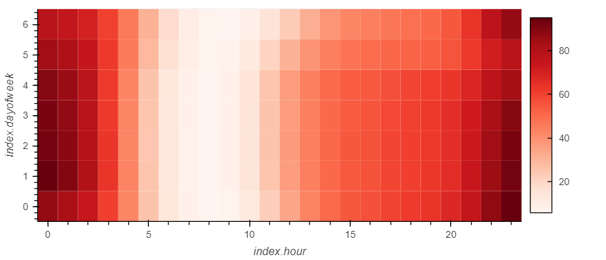

- I first grouped the traffic by the week of the year, and I used hvplot to plot it. It showed that the search traffic tend to increase during the winter holiday period. It started to rise from week 42, and at its relative high at week 51, just before it dropped.
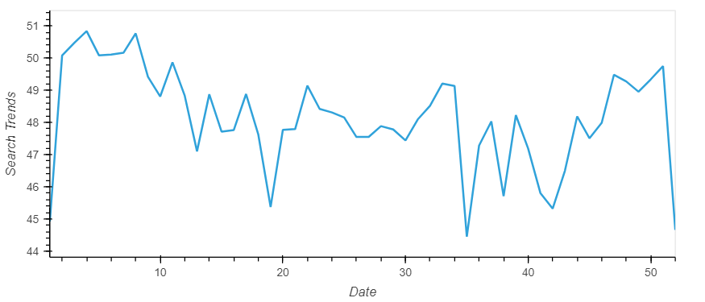

- To relate the search traffic to stock price patterns, I first concatenated the two dataframe `df_mercado_stock` and `df_mercado_trends` together, and I used hvplot to visualize the close and search trends data. The closing price did show an uptrend after the downtrend during late Feburary to April due to the initial shock to global financial markets, new customers and revenue increased for e-commerce platforms. However, the search trend stayed in a stable range throughout the whole time period, with daily uptrend and down trend cycle. There is a notable uptick on 5/5/2020, which matched the significant uptrend of closing price on the same day.
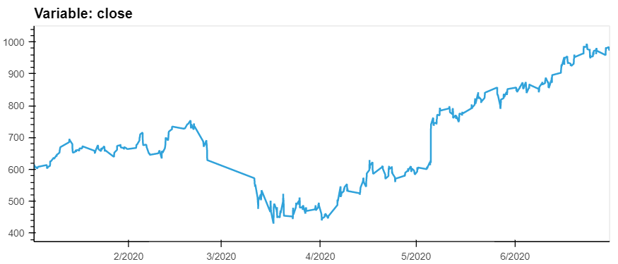
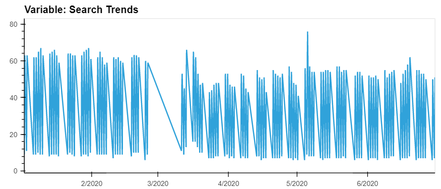

- I created some extra columns such as `Lagged Search Trends`, `Stock Volatility` and `Hourly Stock Return`, and I constructed the correlation table to evaluate whether there is a predictable relationship exist between the lagged search traffic and the stock volatility or between the lagged search traffic and the stock price returns. Even though there is a slightly negative correlation between lagged search traffic and the stock volatility, and a slightly positive correlation between the lagged search traffic and the stock price returns, the values of both correlation are under 0.30, which are considered negligible statistically.
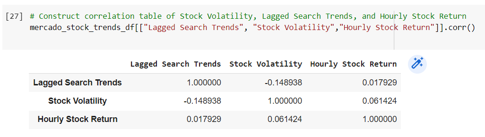

- During this process, I also found out that the stock volitility spiked and tended to stay high, during the first half of 2020. This is a common characteristic of volatility in stock returns worldwide: high volatility days tend to be followed by yet more high volatility days. When it rains, it pours. It also matched the narrative in this case study, where it said "Market events emerged during the year of 2020 that many companies found difficult. There is the initial shock to global financial markets."
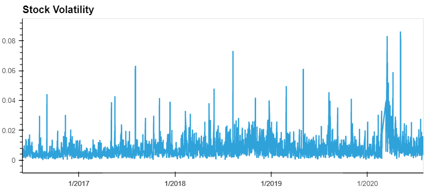

- For further analysis, I have created a time series model with Prophet. I then fit and predicted the search trends. 
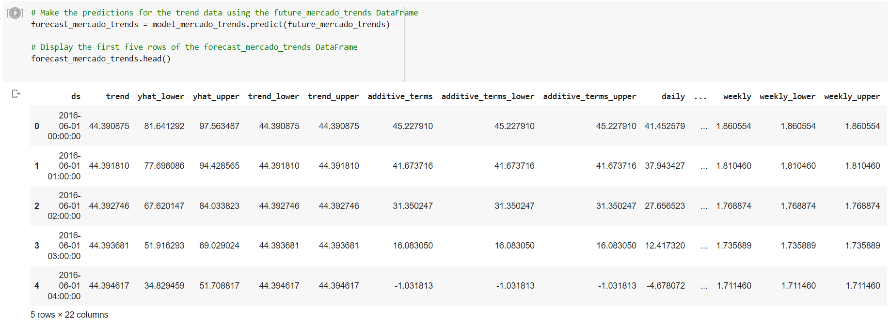

- I have also plotted the forecast of the trends. Base on the plot, and because this is a high-frequency data, in the near-term forecast, the trend seems to go down for a while, and pick up again. It stays in a relatively tight range.
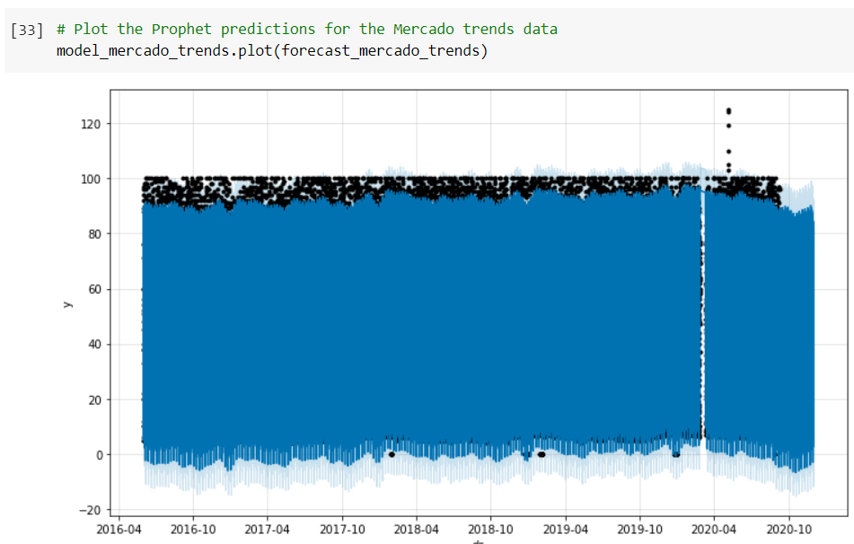

- And because this is a high-frequency data, I have also used the syntax `plot_components()` to gain more meaningful insight for the trends.  Mercado Libre exhibits the greatest popularity at around 12 am daily. And it gets the most search traffic on Tuesdays. The lowest point for search traffic in the calendar year is around October.
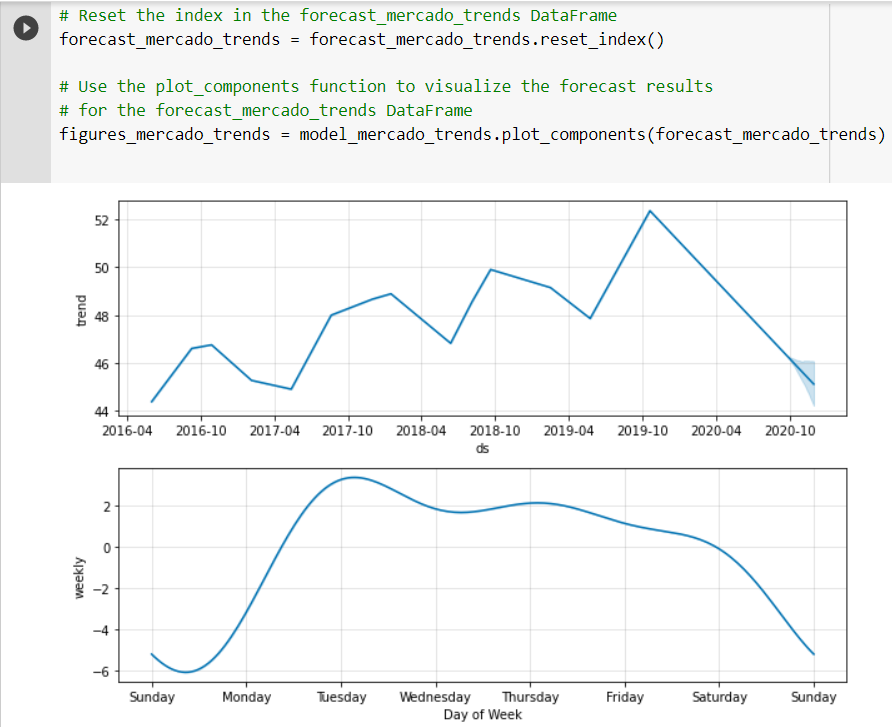
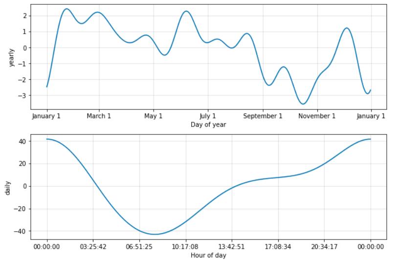

- In addition to the analysis and forecast on the search trends and stock price, I have also completed a forecast on its revenue by using time series models. Firstly by plotting the components, I can see that Wednesdays are the peak revenue days.
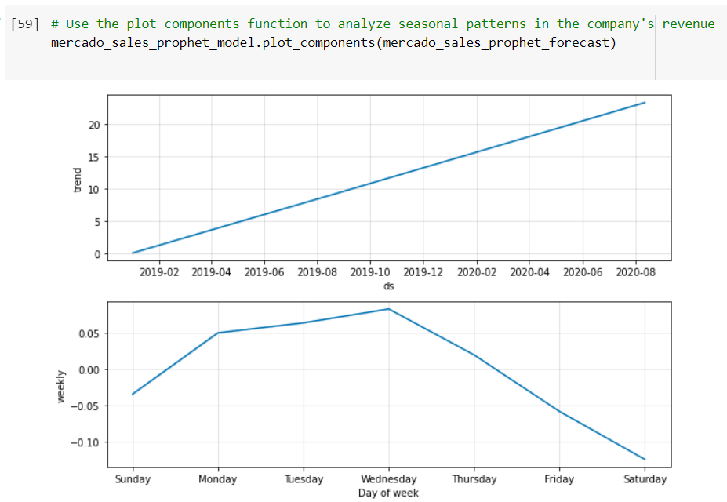

- I have also plotted the forecasted sales revenue. It is showing an uptrend.
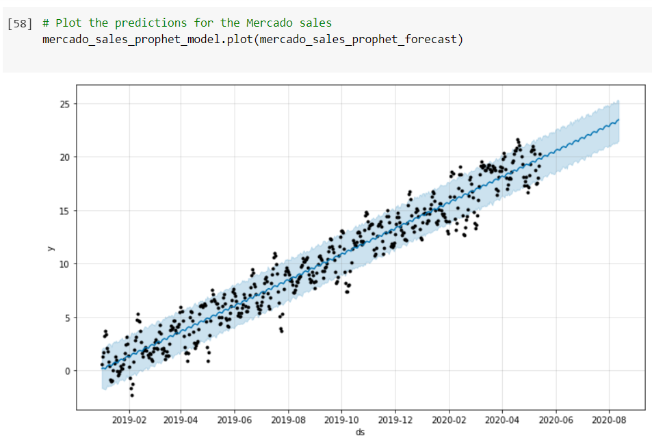

- I then sliced the predicted data and rename the columns to match what the finance division is looking for. And I have a dataframe looks like the following (partially):
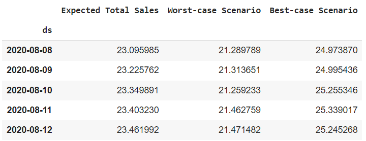

- Finally, to be able to provide a sales forecast for the finance division, giving them a number for expected total sales next quarter. Include best and worst case scenarios, to better help the finance team plan, I used `.sum()` function to sum up all the predicted sales and the best and worst case scenarios. And I have forecasted that the expected total sales for the next quarter is $969.607010. The worst-case scenario is $887.087722, and the best-case scenario is $1051.065472.
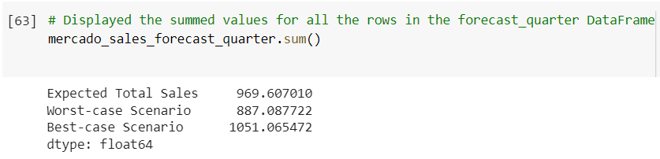

## Skills:
- Prophet: Time Series Forecasting
- Data Visualisation: hvplot
- Data preperation: Pandas
- Numpy
- Google Colab
- Correlation as heatmap

## Implementation:
- Identifying patterns in time series data.
- Mining for patterns in seasonality by using visualizations.
- Building sales-forecast and user-interest predictive models.
